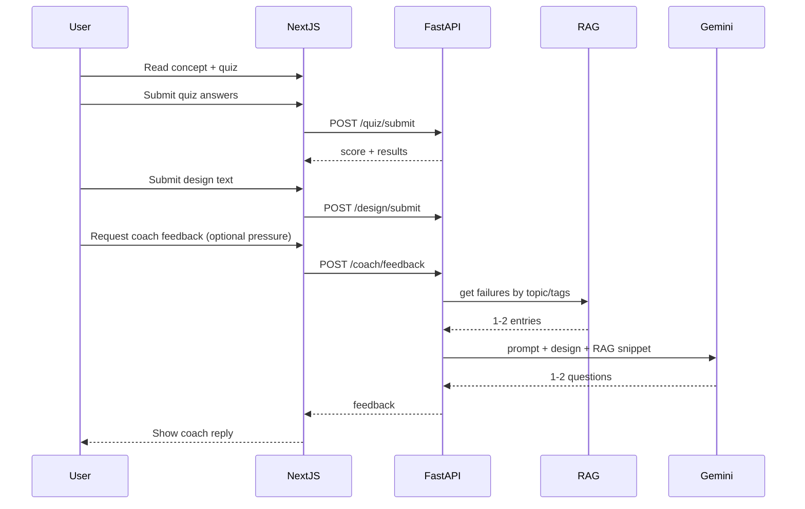

# Crucible — 2-Day MVP Plan

---

## 1. Phase-by-Phase Plan

### Day 1: Core Learning Loop


| Phase                  | Scope                                            | Deliverables                                                                                                                |
| ---------------------- | ------------------------------------------------ | --------------------------------------------------------------------------------------------------------------------------- |
| **1.1 Scaffold**       | Monorepo, Next.js App Router, FastAPI, env       | Repo runs locally: `npm run dev` + `uvicorn`                                                                                |
| **1.2 Content**        | One concept + one quiz as JSON                   | `content/concept.json`, `content/quiz.json`; Next.js pages read and render text                                             |
| **1.3 Quiz flow**      | Submit answers, validate, show result            | `POST /quiz/submit`; simple correct/incorrect; no persistence                                                               |
| **1.4 Design submit**  | User writes design in textarea, sends to backend | `POST /design/submit`; store in memory or single JSON file for session                                                      |
| **1.5 Coach (no RAG)** | One stateless LLM endpoint                       | `POST /coach/feedback` with design + optional quiz context; Gemini Flash returns 1–2 Socratic questions; system prompt only |


**Day 1 exit criteria:** User can read concept → take quiz → submit design → get back 1–2 coach questions (no RAG yet).

---

### Day 2: RAG + Pressure Testing


| Phase                       | Scope                                                     | Deliverables                                                                                                                                                             |
| --------------------------- | --------------------------------------------------------- | ------------------------------------------------------------------------------------------------------------------------------------------------------------------------ |
| **2.1 RAG content**         | One “failure mode” JSON file, keyword/tag retrieval       | `content/rag/failures.json`; FastAPI endpoint loads JSON, filters by tag/keyword (e.g. “caching”, “latency”)                                                             |
| **2.2 Coach + RAG**         | Inject 1–2 RAG facts into coach prompt when relevant      | `POST /coach/feedback` accepts optional `topic`; backend retrieves 1–2 matching failure entries, adds to prompt as “challenge the user with these, do not reveal source” |
| **2.3 Pressure step in UI** | After first coach reply, user can request “pressure test” | Same `POST /coach/feedback` with flag `pressure_test: true`; backend pulls RAG entries and asks coach to challenge design with those failure modes                       |
| **2.4 Deploy**              | Vercel (Next), Cloud Run (FastAPI)                        | Env vars for API URL and Gemini key; CORS for Vercel origin                                                                                                              |


**Day 2 exit criteria:** Full loop with one RAG-backed pressure test; deployable.

---

## 2. Repo Structure (Cursor-Optimized)

```
crucible/
├── README.md                 # One-page: run frontend/backend, env vars
├── .env.example              # NEXT_PUBLIC_API_URL, GEMINI_API_KEY (backend)
├── frontend/                 # Next.js 14+ App Router
│   ├── app/
│   │   ├── layout.tsx
│   │   ├── page.tsx          # Single flow: concept → quiz → design → coach → pressure
│   │   ├── globals.css
│   │   └── api/              # Optional: proxy to FastAPI if needed
│   ├── components/           # ConceptView, Quiz, DesignForm, CoachReply, PressureBlock
│   ├── package.json
│   └── next.config.js
├── backend/                  # FastAPI
│   ├── main.py               # App, CORS, routes
│   ├── requirements.txt
│   ├── config.py             # Env (GEMINI_API_KEY, path to content)
│   ├── routers/
│   │   ├── quiz.py           # POST /quiz/submit
│   │   ├── design.py         # POST /design/submit
│   │   └── coach.py          # POST /coach/feedback (Gemini + RAG)
│   ├── services/
│   │   ├── llm.py            # Gemini Flash client, stateless generate
│   │   └── rag.py            # Load JSON, keyword/tag filter
│   └── content/              # Symlink or copy from root content/
├── content/                  # Single source of truth for JSON
│   ├── concept.json
│   ├── quiz.json
│   └── rag/
│       └── failures.json
└── docs/                     # Optional: API.md for contracts
```

**Cursor tips:** Keep `frontend/` and `backend/` at root so Cursor can index both; single `content/` avoids duplication.

---

## 3. API Contracts

### 3.1 Submit quiz answers

```http
POST /quiz/submit
Content-Type: application/json

{
  "answers": [
    { "questionId": "q1", "selectedOptionId": "a" },
    { "questionId": "q2", "selectedOptionId": "b" }
  ]
}

Response 200:
{
  "score": 2,
  "total": 2,
  "results": [
    { "questionId": "q1", "correct": true },
    { "questionId": "q2", "correct": false }
  ]
}
```

- No auth; no persistence. Idempotent for same body.

---

### 3.2 Submit a design

```http
POST /design/submit
Content-Type: application/json

{
  "designText": "User writes their system design in plain text..."
}

Response 200:
{
  "accepted": true,
  "designId": "uuid-or-session-id"   // optional; for MVP can be omitted or in-memory
}
```

- Backend may store in memory or append to a single file for the session. No DB.

---

### 3.3 Get agent (Design Coach) feedback

```http
POST /coach/feedback
Content-Type: application/json

{
  "designText": "User's current design text",
  "topic": "caching",                    // optional; for RAG retrieval
  "pressureTest": false,                 // true = use RAG failures to challenge
  "conversationContext": []              // optional; array of { role: "user"|"assistant", text } for this session only (stateless: client sends last N turns)
}
```

- **Stateless:** no server-side conversation store. Client sends recent turns; Gemini receives only that plus system prompt + optional RAG snippet.
- **RAG:** When `pressureTest: true` or `topic` present, backend fetches 1–2 entries from `failures.json` (keyword/tag) and injects into system/user prompt as “use these to challenge, do not quote.”

```http
Response 200:
{
  "feedback": "1–2 Socratic questions or short challenges (text only)"
}
```

- No streaming for MVP (simplifies FastAPI and frontend).

---

## 4. Example JSON

### 4.1 One learning concept — `content/concept.json`

```json
{
  "id": "caching-basics",
  "title": "Caching basics",
  "body": "Caching stores copies of data in a faster layer so repeated reads are cheaper. Key tradeoffs: consistency (stale vs fresh), eviction (what to drop when full), and placement (client, server, distributed).",
  "tags": ["caching", "latency", "consistency"]
}
```

---

### 4.2 One quiz — `content/quiz.json`

```json
{
  "id": "quiz-caching",
  "conceptId": "caching-basics",
  "questions": [
    {
      "id": "q1",
      "text": "What is a common downside of cache-aside?",
      "options": [
        { "id": "a", "text": "Cache stampede under load", "correct": true },
        { "id": "b", "text": "Higher latency", "correct": false }
      ]
    },
    {
      "id": "q2",
      "text": "Where is TTL typically enforced?",
      "options": [
        { "id": "a", "text": "At the cache layer", "correct": true },
        { "id": "b", "text": "At the database", "correct": false }
      ]
    }
  ]
}
```

---

### 4.3 One RAG failure entry — `content/rag/failures.json`

```json
{
  "entries": [
    {
      "id": "f1",
      "tags": ["caching", "failure"],
      "keywords": ["stampede", "thundering herd", "expiry"],
      "fact": "When many requests miss the cache at once (e.g. after TTL expiry), all hit the backend. This can cause a spike or outage.",
      "promptHint": "Challenge the user about what happens when the cache expires for a hot key."
    }
  ]
}
```

- **Retrieval:** Match request `topic` or design keywords to `tags` / `keywords`; return 1–2 `fact` + `promptHint` for the coach prompt. No vectors.

---

## 5. Minimal System Prompt (Design Coach, Gemini Flash)

Keep it short so Flash follows reliably:

```
You are a System Design Coach. Your only job is to deepen the learner's thinking.

Rules:
- Never give full solutions or implement for them.
- Reply with at most 2 short Socratic questions. No long explanations.
- Focus on tradeoffs, assumptions, and edge cases.
- If you receive [CHALLENGE] facts below, use them to question or pressure-test their design. Do not quote the facts verbatim or reveal their source.

[CHALLENGE]
{rag_snippet_or_empty}
```

- `{rag_snippet_or_empty}`: when RAG is used, inject 1–2 lines per entry (e.g. `promptHint` + one sentence from `fact`). Empty when no RAG.

---

## 6. Out-of-Scope (Do Not Build)

- Auth, user accounts, persistence of progress
- Voice, diagrams, images, file uploads
- Multiple agents or agent memory
- Vector DB or embeddings; only file-based JSON + keyword/tag RAG
- Multiple modules or courses; exactly one concept + one quiz
- Streaming responses
- Retries, rate limits, or production-grade error handling beyond basic 4xx/5xx
- Tests (unless a single smoke test for the loop)
- Admin UI or content CMS

---

## 7. Verification Checklist

- **2 days:** Day 1 = one learning loop without RAG; Day 2 = RAG + pressure + deploy. Scope is one concept, one quiz, one coach, one RAG file.
- **One full loop:** Concept → Quiz → Design → Coach feedback → (optional) Pressure test with RAG. Achievable with the above APIs and one linear flow in `page.tsx`.
- **Agent enhances learning:** System prompt and RAG usage force Socratic questions and challenges only; no solution dumping.
- **Stateless Gemini:** No conversation stored on server; client sends last N messages; each request is independent.

---

## 8. Data Flow (High Level)




